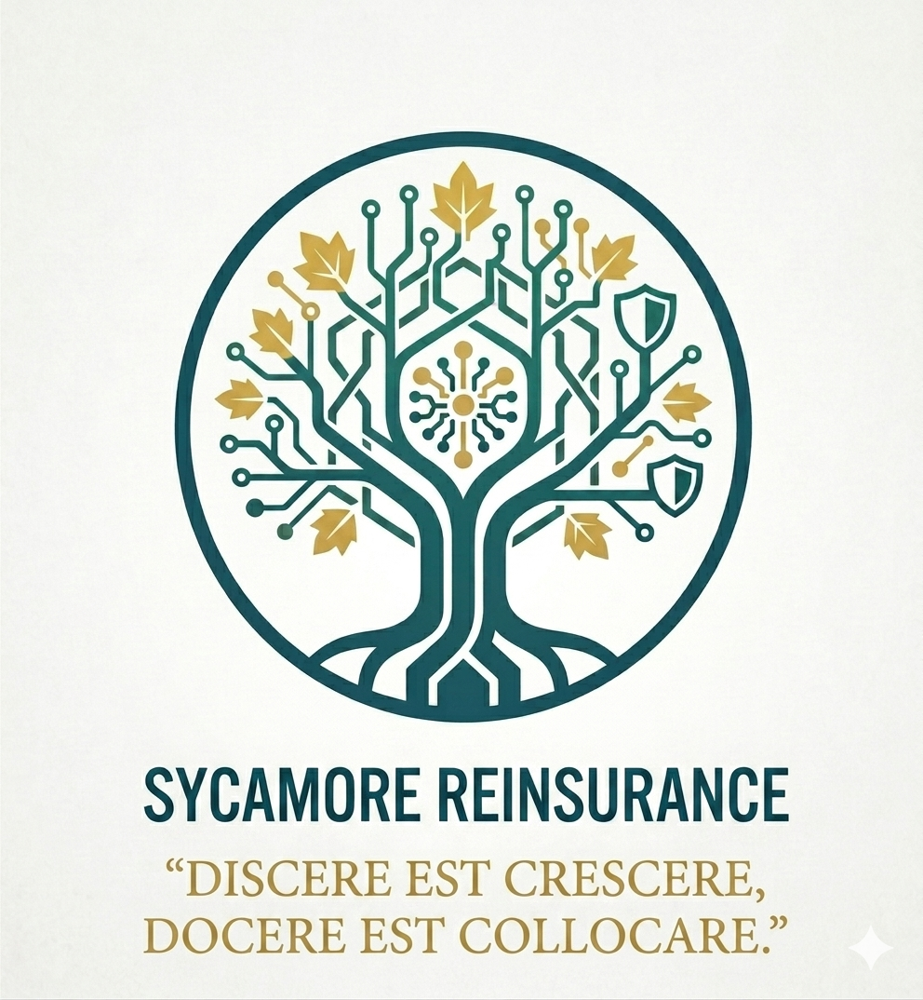

::: {style="text-align: center; padding: 1rem 0 2rem 0;"}
{width="200" fig-alt="Sycamore Reinsurance corpus mark — synthetic test-corpus issuer."}
:::

---

## The problem this tool solves

A reinsurance underwriter's work runs on documents. To assess a
single risk, they typically need to consult three categories of
source:

::: {.grid}

::: {.g-col-12 .g-col-md-4}
### Regulations
PRA Supervisory Statements, EIOPA Guidelines, the Solvency II
framework. *What the regulator requires.*
:::

::: {.g-col-12 .g-col-md-4}
### Public commitments
Peer reinsurers' sustainability reports, thermal-coal
exclusions, net-zero pledges. *What the market position is.*
:::

::: {.g-col-12 .g-col-md-4}
### Internal policies
Risk-appetite statements, delegated-authority matrices,
underwriting manuals. *What the firm itself allows.*
:::

:::

Each individual document is dense, and the stack an underwriter
is expected to know is growing. The cost is not the *reading*;
it is the *searching* — locating the specific paragraph that
answers the specific question, before the professional judgment
they were hired to apply can even begin.

::: {.grid style="padding-top: 1rem;"}

::: {.g-col-12 .g-col-md-6}
### Today
An underwriter assessing a treaty opens a stack of PDFs. They
know what they are looking for — paragraph 4.124 of PRA SS5/25,
the relevant table in Munich Re's 2023 disclosure, the clause in
the internal delegated-authority matrix. They search PDF by PDF
until they find it. The judgment they were trained to apply
begins only after the searching is done.
:::

::: {.g-col-12 .g-col-md-6}
### With Cedant
The same underwriter asks Cedant a natural-language question.
Cedant returns an answer paired with citations to specific
paragraphs in the source documents. The underwriter clicks
through to verify, reads the paragraph in context, and applies
their judgment. The searching collapses from hours to seconds.
:::

:::

The leverage is straightforward: hours of senior professional
time per week, returned to the work that requires their
professional expertise.

---

## How it works

```{mermaid}
sequenceDiagram
    autonumber
    participant U as Underwriter
    participant C as Cedant
    participant D as Document Library

    U->>C: "What is Munich Re's<br/>thermal coal underwriting policy?"
    C->>D: Search for relevant paragraphs
    D-->>C: Top-ranked paragraphs returned
    Note over C: Local language model<br/>writes a cited answer
    C-->>U: Cited answer +<br/>verifiable source paragraphs
```

Three properties make this flow useful in an underwriting
context:

- **Every claim is cited.** Cedant cannot answer without
  pointing to a specific paragraph in a specific document. If it
  cannot find a relevant passage, it says so.

- **Citations are structurally verified.** Cedant checks that
  every citation in its answer corresponds to a real paragraph
  that was actually used to generate the answer. A citation that
  looks valid but does not resolve to a real source is caught
  before the underwriter sees it — and surfaced explicitly if it
  occurs, not silently allowed through.

- **It refuses rather than guesses.** When the document library
  does not contain the answer, Cedant says *"I cannot answer
  this from the provided sources"* — and means it. A confident-
  sounding fabrication would be worse than no answer at all.

::: {style="text-align: center; padding: 2rem 0;"}
[Start with the Executive Summary →](sections/01_executive_summary.qmd){.btn .btn-primary role="button"}
:::

---

## What you'll find in this report

A technical report on the design, evaluation, and limits of the
system described above — a working prototype, locally
reproducible, that runs on a single laptop with no third-party
service calls at any stage.

Three things make this report worth reading:

- **The numbers are real.** Every figure in the Results section
  is traceable to a committed evaluation run on the repository
  and can be regenerated from the underlying data. No invented
  decimals; no smoothed averages; no cherry-picked subsets.

- **The retractions are on the record.** Two claims this project
  once held were retracted (or weakened) when the evidence
  demanded it. Both are documented by timestamp and commit hash,
  append-only — visible at any time in the project's journal.

- **The methodology is the deliverable.** Pre-stated criteria
  that, if met, would force the project to retract its own
  claims. Named conditions under which the conclusions would
  change. Deferrals treated as design decisions in their own
  right. The discipline of measuring honestly is the engineering
  posture the report is meant to demonstrate.

[Read the Executive Summary →](sections/01_executive_summary.qmd)

---

::: {.callout-note appearance="minimal"}
**A note on the corpus mark above.** The logo is for *Sycamore
Reinsurance*, a fictional issuer the project uses to demonstrate
that the pipeline extends to internal-style documents. Sycamore's
synthetic documents are drafted but not indexed in the current
release; the evaluation numbers reported here are exclusively
against four real issuers (PRA, EIOPA, Munich Re, Swiss Re). The
carve-out is honest accounting and is explained in detail in *The
Corpus*.
:::
