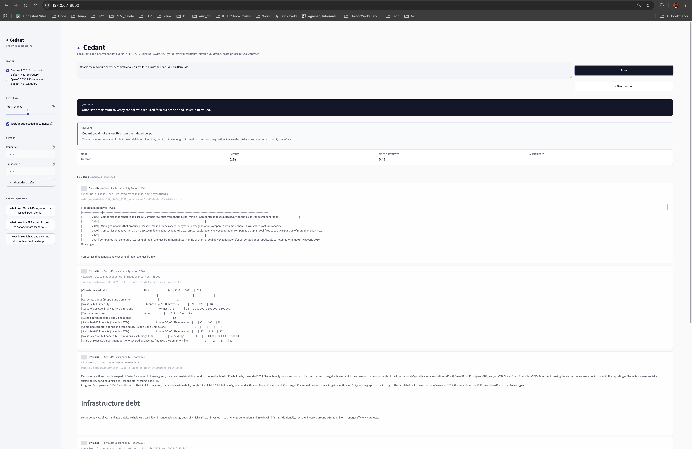

::: {.callout-note icon=false}
## Plain-Language Summary

This section describes the system as a piece of software a reader
would actually run — what commands to invoke, in what order, to
reproduce every result in this report. The pipeline has two main
code objects (a *Retriever* that finds chunks for a question, and
an *AnswerGenerator* that turns those chunks into a cited answer);
every surface — the evaluation harness, the command-line tools, the
Streamlit analyst interface — uses the same two objects. This shared
backbone means the answers the analyst sees in the UI are produced
by the same code path the eval measures.
:::

---

## Two Core Abstractions {#sec-pipeline-core}

All inference surfaces — eval, CLI, Streamlit — sit on top of two
small Python classes. Their constructors, public methods, and
return types are the contract every other surface depends on.

### `Retriever` — hybrid retrieval over the indexed corpus

```python
from underwriting_copilot.retrieve import Retriever

retriever = Retriever()
hits = retriever.retrieve(
    query="What is Munich Re's underwriting policy on thermal coal?",
    top_k=5,
    exclude_superseded=True,
)
```

The constructor loads its three dependencies once — the BM25
vocabulary, the Qdrant client, and the BGE-M3 model + tokenizer —
and reuses them across queries. This matters for latency: warm-loaded
retrieval is 30–50 ms per query; cold-starting a `Retriever` per
query would cost several seconds on the BGE-M3 load alone.

The return type is a list of `RetrievalHit` dataclasses:

```python
@dataclasses.dataclass(frozen=True)
class RetrievalHit:
    chunk_id: str
    score: float
    dense_rank: int | None
    sparse_rank: int | None
    payload: dict[str, Any]
```

Three details worth highlighting:

- **`dense_rank` and `sparse_rank` are exposed** as separate fields
  rather than collapsed into the fused `score`. They are 1-based
  ranks within each channel's top-N candidates; `None` means the hit
  did not appear in that channel's candidate list. A debug question
  ("why did this chunk rank high?") is answerable directly from
  these two fields — a dense-driven hit (sparse_rank None) is
  qualitatively different from a both-channels hit, even when their
  fused scores are similar.
- **The `payload` is self-describing.** Per D012, every Qdrant point
  carries the full chunk text plus its hand-curated metadata. No
  secondary store has to be consulted to materialise the chunk text
  or its provenance, which matters for the Streamlit UI's source-
  card rendering and for the eval's gold-chunk verification.
- **The default top_k is 5**, matching what the eval used to produce
  the headline numbers in Section 6. A reader who reproduces the
  eval inherits the same top-k unless they override.

### `AnswerGenerator` — single-shot cited generation

```python
from underwriting_copilot.answer import AnswerGenerator

gen = AnswerGenerator(retriever)  # uses production defaults
result = gen.answer("What is Munich Re's underwriting policy on thermal coal?")
```

Construction takes the `Retriever` plus optional model and endpoint
overrides. The full constructor signature, with the production
defaults inlined:

```python
def __init__(
    self,
    retriever: Retriever,
    model: str | None = None,            # → D015 default: gemma-4-31B-it-MLX-6bit
    api_base: str = DEFAULT_API_BASE,    # → http://127.0.0.1:8000/v1
    api_key: str = DEFAULT_API_KEY,
    timeout: float = DEFAULT_TIMEOUT_SECONDS,
    max_tokens: int = DEFAULT_MAX_TOKENS,
    system_prompt: str = SYSTEM_PROMPT,  # → frozen v2 (Section 4)
    enable_thinking: bool = DEFAULT_ENABLE_THINKING,
) -> None:
    ...
    self.model = _resolve_model(model)
```

The `_resolve_model` helper (Section 4) applies the twelve-factor
precedence: explicit > environment variable > hardcoded default.
Resolution happens at constructor call time, not at module import
time, so a sweep harness can flip the environment variable mid-
process and get the new model on the next constructor invocation.

The return type is an `AnswerResult` dataclass with eight fields:

```python
@dataclasses.dataclass(frozen=True)
class AnswerResult:
    query: str                             # the question asked
    answer: str                            # raw LLM output
    citations: list[str]                   # chunk_ids cited that were in the context
    hallucinated_citations: list[str]      # chunk_ids cited that were NOT in the context
    used_chunks: list[RetrievalHit]        # full retrieval context the LLM saw
    refused: bool                          # exact-phrase refusal detector output
    elapsed_seconds: float                 # wall-clock for retrieve + LLM call
    model: str                             # which model was actually used
```

Four properties of this type are load-bearing:

- **`citations` and `hallucinated_citations` are disjoint.** The
  validator (Section 4) partitions every cited `chunk_id` into one
  or the other; nothing falls through. A caller cannot accidentally
  treat a fabricated citation as valid.
- **`used_chunks` is the full retrieval context.** A reviewer can
  reconstruct exactly what the LLM saw — which chunks, in what
  rank order, with what fused scores — by reading this field. The
  eval and the Streamlit UI both use this for their source-card
  rendering.
- **`refused` is a Boolean.** When `True`, the `answer` field
  contains the refusal phrase (or a pre-LLM refusal marker when no
  chunks were retrieved at all). The Boolean is the contract
  signal; the prose is illustrative.
- **`elapsed_seconds` covers retrieve + generate.** The number
  matches the latency reported in the eval's headline table.

### The shared-backbone principle

Both abstractions are constructed once and reused. The eval's
runner, the smoke-test CLI, and the Streamlit UI all instantiate
the same two classes with the same defaults. No surface has its
own retrieval logic, its own prompt, or its own citation parser.
This is the property that makes the eval-time behaviour and the
UI-time behaviour the same behaviour — a divergence between them
would have to come from a configuration override, not from
parallel code paths.

The journal records this as a deliberate D013 follow-on (Day-5
when the Streamlit UI was added): the temptation to give the UI
its own answer-rendering path was rejected on the basis that the
UI's job is to render `AnswerResult`, not to produce it.

---

## End-to-End Inference Walkthrough {#sec-pipeline-walkthrough}

For a single question, the complete control flow is:

```
                  ┌─────────────────────────────────────────┐
                  │ AnswerGenerator.answer(query)           │
                  └────────────────────┬────────────────────┘
                                       │
                                       ▼
            ┌──────────────────────────────────────────────┐
            │ Retriever.retrieve(query, top_k=5)           │
            │ • Embed query via BGE-M3 (CLS+L2-normalised) │
            │ • Tokenise + Porter-stem for BM25            │
            │ • Qdrant hybrid query (dense + sparse)       │
            │ • RRF fusion (k=60) → top-k RetrievalHits    │
            └────────────────────┬─────────────────────────┘
                                 │
                                 ▼
            ┌──────────────────────────────────────────────┐
            │ AnswerGenerator._build_user_prompt(hits)     │
            │ • Format SOURCES block with chunk_ids        │
            │ • Concatenate QUESTION                       │
            └────────────────────┬─────────────────────────┘
                                 │
                                 ▼
            ┌──────────────────────────────────────────────┐
            │ POST http://127.0.0.1:8000/v1/chat/completions│
            │ • system: SYSTEM_PROMPT v2                   │
            │ • user: SOURCES + QUESTION                   │
            │ • temperature: 0.0 (hard-pinned)             │
            └────────────────────┬─────────────────────────┘
                                 │
                                 ▼
            ┌──────────────────────────────────────────────┐
            │ AnswerGenerator._post_process(answer)        │
            │ • CITATION_REGEX → extract all [chunk_id]    │
            │ • Partition: valid vs hallucinated           │
            │ • Refusal detector → strict exact-phrase     │
            └────────────────────┬─────────────────────────┘
                                 │
                                 ▼
            ┌──────────────────────────────────────────────┐
            │ return AnswerResult(...)                     │
            └──────────────────────────────────────────────┘
```

Every step has a corresponding section in the codebase
(`src/underwriting_copilot/retrieve.py`, `src/underwriting_copilot/
answer.py`) and a corresponding test (`tests/test_retrieve.py`,
`tests/test_answer.py`). The full test suite (158+ pipeline tests +
19 AppTest tests for the UI = 177+ tests) runs in under a minute
on the production hardware.

---

## Command-Line Surfaces {#sec-pipeline-cli}

The project has no installed console scripts (no `pyproject.toml`
`console_scripts` entries). All CLI invocations are via `uv run
python -m <module>` so the environment is explicit at every call.

### Smoke test — single question, single cell

```bash
uv run python -m eval.runner \
  --question-ids q002 \
  --models gemma-4-31B-it-MLX-6bit \
  --prompts v2
```

Runs one question (`q002`) through one cell (Gemma × v2) and writes
a one-record JSONL to a fresh `eval/results/<timestamp>/`
directory. The full retrieve → generate → cite → validate path is
exercised. Total wall-clock ~20–30 seconds on the production
hardware. This is the canonical sanity check after any code change.

### Full sweep — 4 cells × 70 questions

```bash
uv run python -m eval.runner
```

With no filters, the runner sweeps the full grid: 2 models × 2
prompts × 70 questions = 280 cells. The two canonical runs already
on disk (`eval/results/2026-06-18T12-16-35Z/` and
`eval/results/2026-06-18T15-32-07Z/`) reproduce to the bit on the
same software state (temperature 0, fixed seeds where models
support them). Wall-clock ~45 minutes; runs cleanly on a warm-
loaded oMLX serving both models.

The runner writes per-cell records to `raw.jsonl` incrementally,
so a partial run preserves whatever cells completed before
interruption. Resuming from a partial run is currently a manual
step (re-invoke with `--question-ids` listing the remaining
questions); automation is a v2 work item.

### Report regeneration — deterministic markdown from JSONL

```bash
uv run python -m eval.report
```

Reads the latest `raw.jsonl` (or `--results-dir <path>` for a
specific run) and writes `report.md` to the same directory.
Deterministic: same JSONL → same report. The Results section of
this document quotes from the `report.md` produced by this
command; a reviewer can regenerate it from the committed JSONL at
any time.

### Test suite

```bash
uv run pytest                 # full suite, < 1 min
uv run pytest tests/test_app.py  # just the 19 AppTest UI tests
uv run pytest tests/test_answer.py -v  # answer.py only, verbose
```

The suite covers retrieval (parameterised over fixture corpora),
generation (mocked LLM calls, real citation validation), the eval
scorer (deterministic against known inputs), and the Streamlit UI
(via Streamlit's AppTest framework). The UI tests in particular
were added after a class of subtle widget-state bugs surfaced
during Day-5 development; their existence is recorded openly in
the journal as a "should have written these earlier" engineering
lesson.

---

## The Streamlit Analyst Interface {#sec-pipeline-streamlit}

The Streamlit UI is the analyst-facing surface — the screen an
underwriter would actually look at. It is run from the repo root:

```bash
uv run streamlit run app.py \
  --server.port 8502 \
  --server.headless true \
  --server.address 127.0.0.1
```

::: {#fig-streamlit-example}
{fig-alt="The Cedant Streamlit interface showing a cited answer to a PRA SS5/25 question on climate scenario analysis, with inline numbered citation badges, a metrics strip, and a source card with the verbatim chunk text."}

The Streamlit interface answering a PRA SS5/25 question on climate scenario analysis. Inline numbered citation badges link each claim in the prose to a specific chunk. The metrics strip below the answer reports the model (Gemma), wall-clock latency for this query (51.9 seconds — above the ~22.9-second mean reported in Section 6 for the production-default cell), citations resolved against retrieved chunks (19 cited from 5 retrieved), and the hallucination count (zero). The first source card shows the chunk identifier `pra_ss5-25_climate__0027__role-of-scenario-analysis` and the verbatim chunk text the model worked from; further cards (not shown) carry the remaining retrieved chunks. The sidebar exposes the model selector, retrieval top-k, the supersession filter (default on per D012), and optional issuer-type and jurisdiction filters. The Sycamore Reinsurance test-corpus mark in the sidebar footer is labelled explicitly as a synthetic issuer, not a real entity.
:::

The UI's purpose is rendering, not generation. It instantiates the
same `Retriever` and `AnswerGenerator` the eval uses, calls
`gen.answer(query)` on user input, and renders the resulting
`AnswerResult` with three structural elements:

- **The answer body**, with citations rendered as green badges
  inline with the prose. Each badge shows the chunk's
  `document_id`, version, and effective date pulled from the
  payload's metadata. Hovering reveals the chunk's section path.
- **Hallucinated citations rendered as red `[?]` badges.** The
  structural validator's output is surfaced directly; the user
  cannot mistake a fabricated citation for a real one.
- **Source cards below the answer**, one per chunk in
  `used_chunks`. Each card shows the chunk text in full, the
  per-channel ranks, and the fused score. The user can verify the
  answer against the chunks the model actually saw.

When `result.refused` is `True`, the UI replaces the answer-body
path with a dedicated refusal card. The retrieved chunks are still
shown below, so the user can verify the refusal decision was
sound. This makes refusal a first-class outcome rather than an
error state.

The UI's session state and sample-click handling went through
several iterations during Day-5 development; the final form is
documented in the journal entries for 2026-06-18 and 2026-06-19.
The Streamlit AppTest harness covers the load-bearing behaviours
(sample click → query population, Ask click → result render,
"new question" reset).

---

## Diagnostic Logging {#sec-pipeline-logging}

Every code path that matters logs a single line to stderr in a
fixed format:

```
[cedant 14:32:07] entering Retriever.__init__ — loading BM25 + Qdrant + BGE-M3
[cedant 14:32:11] Retriever ready — 3.8s cold-start
[cedant 14:32:15] AnswerGenerator: query="thermal coal munich re", k=5
[cedant 14:32:15] retrieve returned 5 hits in 41ms
[cedant 14:32:38] LLM call complete — 22.7s, 304 tokens out
[cedant 14:32:38] citations: 4 valid, 0 hallucinated
```

The `[cedant HH:MM:SS]` prefix is consistent across all surfaces
(retrieve, generate, Streamlit, eval) and is grep-able when
diagnosing a Streamlit session that produced an unexpected answer.
The rule is *state transitions only, not per-render noise*: the
log shows what the code did, not what it considered doing.

This pattern was promoted from ad-hoc print statements during
Day-5 Streamlit debugging, after a class of "looks right but wrong
chunks shown" bugs surfaced and the existing logging was too
sparse to diagnose them quickly. The pattern is now standing
operational discipline across the codebase.

---

## Reproduction From Scratch {#sec-pipeline-reproduce}

A reviewer wanting to reproduce every number in this report runs
the following sequence, assuming Apple Silicon hardware with at
least 64 GB unified memory and oMLX installed:

```bash
# 1. Clone and set up the environment
git clone https://github.com/Sidney-Bishop/underwriting-copilot.git
cd underwriting-copilot
uv sync

# 2. Start oMLX with both models loaded (separate terminal)
omlx serve --models gemma-4-31B-it-MLX-6bit,Qwen3.6-35B-A3B-4bit

# 3. Build the index (one-shot, ~2 min)
uv run python -m underwriting_copilot.index --rebuild

# 4. Smoke-test the pipeline on one question
uv run python -m eval.runner \
  --question-ids q002 \
  --models gemma-4-31B-it-MLX-6bit \
  --prompts v2

# 5. Run the full N=70 sweep (~45 min)
uv run python -m eval.runner

# 6. Regenerate the report
uv run python -m eval.report

# 7. Launch the Streamlit UI
uv run streamlit run app.py \
  --server.port 8502 \
  --server.headless true \
  --server.address 127.0.0.1
```

Steps 5 and 6 should produce a `raw.jsonl` and `report.md` whose
content matches the committed
`eval/results/2026-06-18T15-32-07Z/report.md` to the bit, given
the same software state. Any divergence is a software-state
difference worth diagnosing (different model quantisation,
different MLX version, different BGE-M3 weights) — not eval
noise.

---

## What This Section Did Not Cover {#sec-pipeline-not-covered}

Three operational concerns are real for a production deployment
and are scoped out of v1:

- **Multi-user concurrency.** The Streamlit UI is single-operator;
  multi-user deployment requires session isolation work that is
  not in v1. `docs/security.md` records this.
- **Authentication.** The oMLX endpoint accepts an OpenAI-style
  bearer token; the v1 default is a placeholder accepted only
  because the endpoint listens on `127.0.0.1`. Production
  deployment is scoped explicitly in `docs/security.md`.
- **Index rebuild on corpus change.** The index is a one-shot
  rebuild per D012; incremental updates are not supported. Adding
  a document means re-running `python -m underwriting_copilot.index
  --rebuild`. This is acceptable at the v1 corpus size (6
  documents); a 100-document corpus would want incremental
  ingestion as a real work item.

The boundary of what this section described — the production-style
inference surface, the eval harness, the analyst UI, the
reproduction recipe — is the boundary of what the v1 artefact
delivers.

---

## Pipeline at a Glance {#sec-pipeline-glance}

| | |
|---|---|
| **Core abstractions** | `Retriever`, `AnswerGenerator` (sourced from `src/underwriting_copilot/`) |
| **Return types** | `RetrievalHit` (chunk_id, score, dense_rank, sparse_rank, payload), `AnswerResult` (8 fields including disjoint citations/hallucinated_citations and Boolean refused) |
| **Shared backbone** | Eval, CLI, Streamlit UI all use the same constructed `Retriever` + `AnswerGenerator` |
| **CLI invocations** | `uv run python -m eval.runner` (full sweep) · `uv run python -m eval.report` (regenerate markdown) · `uv run pytest` (177+ tests) · `uv run streamlit run app.py ...` (analyst UI) |
| **Production defaults** | top_k=5, exclude_superseded=True, temperature=0.0, model=gemma-4-31B-it-MLX-6bit (D015), prompt=v2 (D014) |
| **Twelve-factor model override** | `UNDERWRITING_COPILOT_MODEL=Qwen3.6-35B-A3B-4bit` env var |
| **Streamlit UI surfaces** | Answer body with green citation badges, red `[?]` for hallucinated citations, source cards with per-channel ranks, refusal card replaces answer body when `refused=True` |
| **Diagnostic logging** | `[cedant HH:MM:SS]` stderr line per state transition, consistent across all surfaces |
| **Reproduction wall-clock** | ~50 minutes end-to-end (2 min index build + 45 min full sweep + 3 min report + sundry) |
| **Determinism** | Same software state → same `raw.jsonl` and `report.md` to the bit |
| **Out of scope for v1** | Multi-user concurrency · production auth · incremental index updates |
